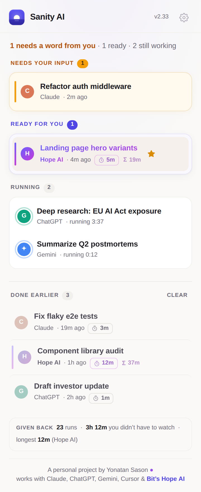
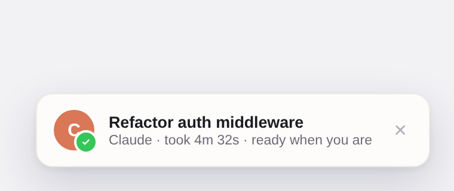
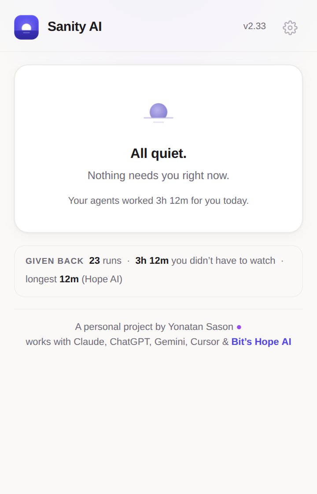

<div align="center">


# Sanity AI

**You can stop checking now.**

A Chrome extension that watches your AI agents — Claude, ChatGPT, Gemini, Cursor, and
[Bit's Hope AI](https://bit.cloud/hope) — and pulls you back the moment one finishes
or needs a word from you. A soft chime, a gentle nudge, a ✅ on the tab, and a live
overview of your whole fleet in the side panel.

*Private by design. Everything stays on your device. Nothing is ever sent anywhere.*

<br>

<picture>
  <source media="(prefers-color-scheme: dark)" srcset="docs/popup-dark.png">
  
</picture>

</div>

---

## Why

Handing work to an AI agent is supposed to free you. Instead you sit there,
alt-tabbing into the same spinner every forty seconds, because the one time you
actually walk away is the one time it stops to ask a question.

Sanity AI ends the spinner-staring. Hand off the task, close the tab if you like,
go do something human. The moment your agent finishes — or pauses and needs your
approval — you'll know. That's the whole product: **the checking, delegated.**

## What you get

| | |
|---|---|
| 🔔 **A chime** | Three soft notes (C–E–G) when a run completes. You'll learn the sound of *done* in a day. |
| 💬 **A gentle nudge** | An OS notification and an in-page toast — click either to jump straight back to the conversation, even if you closed the tab. |
| ✅ **Marks where you look** | A ✅ on the finished tab's title (❓ when an agent is waiting on your approval) and a count on the toolbar icon. |
| 🛬 **A live fleet view** | The side panel (`⌥⇧S`) shows every session by urgency: **Needs your input**, **Ready for you**, **Running** (with live clocks), **Done earlier**. Star the important ones, rename anything, click to fly there. |
| ⏱️ **Time given back** | Local stats reframed the way they should be: *"23 runs · 3h 12m you didn't have to watch."* Export every run to CSV whenever you want. |
| 🤫 **All quiet.** | And when nothing needs you, Sanity says exactly that — and lets you go. |

<div align="center">
<picture>
  <source media="(prefers-color-scheme: dark)" srcset="docs/toast-dark.png">
  
</picture>
</div>

## Watched sites

Claude · ChatGPT · Gemini · Cursor · Hope AI — built in.
Any other site can be added from the panel's ⚙ settings ("Watch this site"); detection
falls back to a scored generic profile so a stray page spinner doesn't cry wolf.

## Install

Sanity AI is a personal project and isn't on the Web Store (yet). Loading it takes a minute:

1. `git clone https://github.com/jonnysas/sanity-ai.git`
2. Open `chrome://extensions`, switch on **Developer mode**
3. **Load unpacked** → pick the cloned folder
4. A welcome page opens — play the chime once so you know the sound

Works on Chrome and Chromium-family browsers (Brave, Edge, Dia; Arc gets a popup
fallback where its side-panel API silently no-ops).

## How it works

No AI, no cloud, no account. Just careful observation:

```
page (MAIN world)          content script (isolated)         service worker
┌─────────────────┐  post  ┌──────────────────────────┐ msg  ┌─────────────────────┐
│ nethook.js      │ ─────▶ │ content.js               │ ───▶ │ background.js       │
│ watches the     │        │ state machine:           │      │ chime (offscreen),  │
│ agent's own     │        │ IDLE → WORKING →         │      │ notifications,      │
│ network request │        │ SETTLING → done          │      │ badge, fleet state, │
│ (fetch/XHR/SSE) │        │ + DOM signals as backup  │      │ run log             │
└─────────────────┘        └──────────────────────────┘      └─────────────────────┘
```

- **Network first.** For each site, the generation rides on a known request
  (an SSE stream, one XHR). `nethook.js` tees the stream and reports the exact
  moment the server closes it — robust across redesigns, works in background tabs.
- **DOM as the safety net.** Per-site profiles (`profiles.js`) know each tool's
  stop buttons, thinking indicators, and approval dialogs. A settle window and a
  minimum-activity threshold keep tool-use pauses and micro-blips from flapping.
- **"Needs your input" detection.** A visible approve-ish button corroborated by a
  reject-ish sibling means your agent is paused mid-run, waiting on you — that's
  surfaced above everything else, in amber.
- **Everything local.** Prompts, durations, and stats live in `chrome.storage`
  on your machine. The CSV export downloads to your disk. There is no server.

## Design

The UI follows one rule: **it should lower your heart rate.** The design system
("Still Water") is documented in the top of [`popup.html`](popup.html) —
warm paper neutrals, a single indigo accent, amber reserved for the one thing that
needs you, motion at breathing pace (a running agent's ring breathes ~15 times a
minute), tabular numerals so ticking clocks never jitter, and full dark-mode and
reduced-motion support. Urgency is the one still, warm thing on a calm surface —
never a blink.

<div align="center">
<picture>
  <source media="(prefers-color-scheme: dark)" srcset="docs/all-clear-dark.png">
  
</picture>
</div>

## Development

```
manifest.json        MV3 manifest
background.js        service worker: notifications, chime, badge, fleet state
content.js           detection engine (state machine) + in-page toast
profiles.js          per-site detection data — tune sites here
nethook.js           MAIN-world network hook (fetch/XHR/SSE)
collapse.js          experiment: collapsible AI responses on Hope
popup.html/js        popup UI (the design system lives in popup.html)
sidepanel.html       GENERATED from popup.html — edit popup.html, run build.py
js/sites.js          custom watched-sites module
js/hopectl.js        "Reading on Hope" panel control
offscreen.*          audio + notification fallback (DOM context)
onboarding.*         the welcome page
tools/gen_icons.py   regenerates icon16/32/48/128.png (pure stdlib)
build.py             regenerates sidepanel.html
```

To tweak a site's detection, edit its profile in `profiles.js`. To add a built-in
site, add a profile *and* a `content_scripts` match in the manifest. After editing
`popup.html`, run `python3 build.py` to regenerate the side panel.

---

<div align="center">

A personal project by **Yonatan Sason** ·
works with Claude, ChatGPT, Gemini, Cursor & [Bit's Hope AI](https://bit.cloud/hope)

*Go be human. I'll chime.*

</div>
